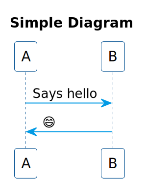
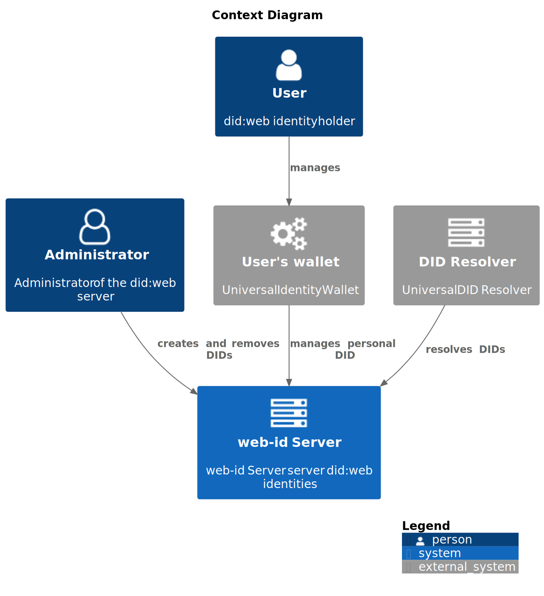
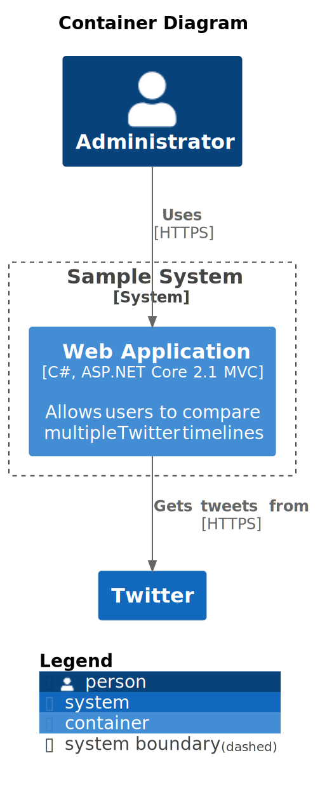
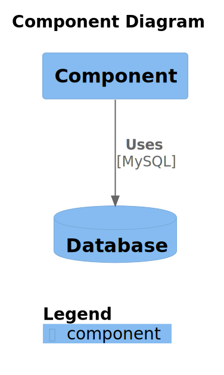

# identinet PlantUML Styles

This repository contains the identinet plantuml styles.

## Installation

- Install [plantuml](https://plantuml.com)
- Use URL reference (slower build times):

```
@startuml

!define identinet https://raw.githubusercontent.com/identinet/plantuml-styles
!include identinet/styles.puml
...

@enduml
```

- Use git submodules (faster build times, but git submodules):
  - Clone this repository into your current directory
    - `git clone git@github.com:identinet/plantuml-styles.git styles`
    - or as a submodule in a git repository
      `git submodule add https://github.com/identinet/plantuml-styles.git styles`
  - Install submodules: `git submodule update --init --recursive`
- Integrate with your [IDE](https://plantuml.com/starting)

## PlantUML Documentation

- [Cheatsheet](https://blog.anoff.io/puml-cheatsheet.pdf)
- [Introduction](https://plantuml.com/starting)
- [Full PDF Guide](https://plantuml.com/guide)
- [The Hitchhiker’s Guide to PlantUML](https://crashedmind.github.io/PlantUMLHitchhikersGuide)

## Usage

### Simple PlantUML Diagram

- See [plantuml documentation](https://plantuml.com) for more information on the
  syntax
- Create a plantuml diagram and include the styles

```
@startuml figures/simple-diagram
!include styles.puml

title "Simple Diagram"

participant "A" as a
participant "B" as b

a -> b: Says hello
b -> a: 😄
@enduml
```



### Standard Library

Plantuml ships with a
[stnardard library](https://github.com/plantuml/plantuml-stdlib) that can be
used.

### C4 Architecture Diagrams

- See
  [C4-PlantUML documentation](https://github.com/plantuml-stdlib/C4-PlantUML)
- See [C4 software architecture model](https://c4model.com/)
- Create a plantuml diagram and include the respective diagram styles

#### Context Diagram

```
@startuml figures/architecture
!include styles.puml

title "Context Diagram"

!include c4/C4_Context.puml
!include sprites/icons/font-awesome/server.puml
!include sprites/icons/font-awesome/user.puml
!include sprites/icons/font-awesome/user_o.puml
!include sprites/icons/font-awesome/building.puml
!include sprites/icons/font-awesome/cogs.puml

Person(admin, "Administrator", "Administrator of the did:web server", $sprite="user_o")
Person(user, "User", "did:web identity holder", $sprite="user")
System_Ext(wallet, "User's wallet", "Universal Identity Wallet", $sprite="cogs")
System(system, "web-id Server", "web-id Server server did:web identities", $sprite="server")
System_Ext(thirdpartysystem, "DID Resolver", "Universal DID Resolver", $sprite="server")

Rel(user, wallet, "manages", "")
Rel(wallet, system, "manages personal DID", "")
Rel(admin, system, "creates and removes DIDs", "")
Rel(thirdpartysystem, system, "resolves DIDs", "")

SHOW_LEGEND()

@enduml
```



#### Container Diagram

```
@startuml figures/container
!include styles.puml

title "Container Diagram"

!include c4/C4_Container.puml

Person(admin, "Administrator")
System_Boundary(c1, "Sample System") {
    Container(web_app, "Web Application", "C#, ASP.NET Core 2.1 MVC", "Allows users to compare multiple Twitter timelines")
}
System(twitter, "Twitter")

Rel(admin, web_app, "Uses", "HTTPS")
Rel(web_app, twitter, "Gets tweets from", "HTTPS")

SHOW_LEGEND()

@enduml
```



#### C4 Component Diagram

```
@startuml figures/component
!include styles.puml

title "Component Diagram"

!include c4/C4_Component.puml

Component(c1, "Component")
ComponentDb(db1, "Database")
Rel(c1, db1, "Uses", "MySQL")

SHOW_LEGEND()

@enduml
```



### Icons

For icons, see
[plantuml-icon-font-sprites](https://github.com/tupadr3/plantuml-icon-font-sprites).

```
@startuml figures/icons

!include ./sprites/icons/devicons/git.puml
!include ./sprites/icons/devicons/sass.puml
!include ./sprites/icons/font-awesome/user.puml
!include ./sprites/icons/font-awesome/star.puml

listsprites

@enduml
```


